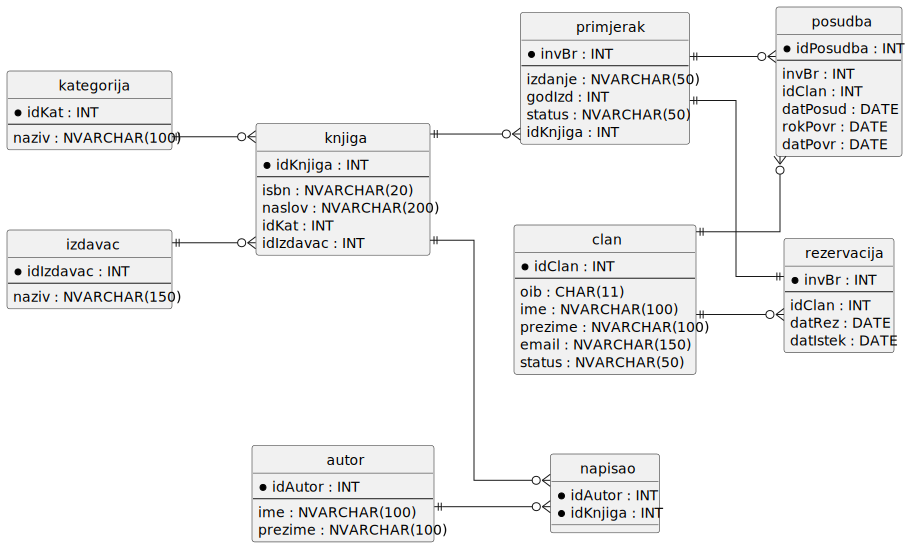

# Knjižnica

## Informacijski sustav knjižnice

Potrebno je modelirati informacijski sustav knjižnice koji omogućava sljedeće funkcionalnosti:

---

### 📚 Katalog knjiga

Za svaku knjigu evidentiraju se osnovni podaci:
- naslov  
- jedinstveni ISBN  
- kategorija  
- izdavač  

Dodatno:
- Knjiga može imati **jednog ili više autora**  
- Autor može napisati **više knjiga**  
- Jedna knjiga može imati **više fizičkih primjeraka**

Za svaki primjerak bilježi se:
- jedinstveni inventarni broj  
- godina izdanja  
- broj izdanja  
- lokacija u knjižnici  
- trenutačni status:
  - slobodan  
  - posuđen  
  - rezerviran  

---

### 👤 Evidencija članova

Za svakog člana evidentiraju se:
- članski broj  
- ime i prezime  
- OIB  
- adresa  
- email  
- datum učlanjenja  
- status:
  - aktivan  
  - deaktiviran  

> Neaktivan član ne može posuđivati ni rezervirati knjige.

---

### 🔄 Posudba knjiga

- Član može posuditi **samo slobodan primjerak**
- Za svaku posudbu evidentiraju se:
  - datum posudbe  
  - rok vraćanja  
  - datum stvarnog vraćanja  

Sustav:
- vodi povijest svih posudbi  
- omogućuje pregled:
  - po članu  
  - po primjerku  

> Jedan primjerak može biti posuđen samo jednom u danom trenutku.

---

### 📌 Rezervacija slobodnih primjeraka

- Ako je primjerak slobodan, član ga može rezervirati na **ograničeno vrijeme** (npr. 2 dana)
- Tijekom rezervacije primjerak **nije dostupan drugim članovima**

Rezervacija se uklanja:
- nakon isteka roka  
- ili nakon realizirane posudbe  

> Jedan primjerak može imati najviše jednu aktivnu rezervaciju.

## ER dijagram


## Relacijski model



## DDL

```sql
CREATE TABLE kategorija (
    idKat INT IDENTITY(1,1) PRIMARY KEY,
    naziv NVARCHAR(100) NOT NULL
);

CREATE TABLE izdavac (
    idIzdavac INT IDENTITY(1,1) PRIMARY KEY,
    naziv NVARCHAR(150) NOT NULL
);

CREATE TABLE autor (
    idAutor INT IDENTITY(1,1) PRIMARY KEY,
    ime NVARCHAR(100) NOT NULL,
    prezime NVARCHAR(100) NOT NULL
);

CREATE TABLE clan (
    idClan INT IDENTITY(1,1) PRIMARY KEY,
    oib CHAR(11) NOT NULL,
    ime NVARCHAR(100) NOT NULL,
    prezime NVARCHAR(100) NOT NULL,
    email NVARCHAR(150) NOT NULL,
    status NVARCHAR(50) NOT NULL,
    CONSTRAINT UQ_clan_oib UNIQUE (oib),
    CONSTRAINT UQ_clan_email UNIQUE (email)
);

CREATE TABLE knjiga (
    idKnjiga INT IDENTITY(1,1) PRIMARY KEY,
    isbn NVARCHAR(20) NOT NULL,
    naslov NVARCHAR(200) NOT NULL,
    idKat INT NOT NULL,
    idIzdavac INT NOT NULL,
    CONSTRAINT UQ_knjiga_isbn UNIQUE (isbn),
    CONSTRAINT FK_knjiga_kategorija
        FOREIGN KEY (idKat) REFERENCES kategorija(idKat),
    CONSTRAINT FK_knjiga_izdavac
        FOREIGN KEY (idIzdavac) REFERENCES izdavac(idIzdavac)
);

CREATE TABLE primjerak (
    invBr INT PRIMARY KEY,
    izdanje NVARCHAR(50) NULL,
    godIzd INT NULL,
    status NVARCHAR(50) NOT NULL,
    idKnjiga INT NOT NULL,
    CONSTRAINT FK_primjerak_knjiga
        FOREIGN KEY (idKnjiga) REFERENCES knjiga(idKnjiga)
);

CREATE TABLE napisao (
    idAutor INT NOT NULL,
    idKnjiga INT NOT NULL,
    CONSTRAINT PK_napisao PRIMARY KEY (idAutor, idKnjiga),
    CONSTRAINT FK_napisao_autor
        FOREIGN KEY (idAutor) REFERENCES autor(idAutor),
    CONSTRAINT FK_napisao_knjiga
        FOREIGN KEY (idKnjiga) REFERENCES knjiga(idKnjiga)
);

CREATE TABLE posudba (
    idPosudba INT IDENTITY(1,1) PRIMARY KEY,
    invBr INT NOT NULL,
    idClan INT NOT NULL,
    datPosud DATE NOT NULL,
    rokPovr DATE NOT NULL,
    datPovr DATE NULL,
    CONSTRAINT FK_posudba_primjerak
        FOREIGN KEY (invBr) REFERENCES primjerak(invBr),
    CONSTRAINT FK_posudba_clan
        FOREIGN KEY (idClan) REFERENCES clan(idClan)
);

CREATE TABLE rezervacija (
    invBr INT PRIMARY KEY,
    idClan INT NOT NULL,
    datRez DATE NOT NULL,
    datIstek DATE NOT NULL,
    CONSTRAINT FK_rezervacija_primjerak
        FOREIGN KEY (invBr) REFERENCES primjerak(invBr),
    CONSTRAINT FK_rezervacija_clan
        FOREIGN KEY (idClan) REFERENCES clan(idClan)
);


INSERT INTO kategorija (naziv)
VALUES 
('Roman'),
('Znanstvena fantastika'),
('Povijest');

INSERT INTO izdavac (naziv)
VALUES
('Znanje'),
('Profil'),
('Mozaik knjiga');

INSERT INTO autor (ime, prezime)
VALUES
('Ivo', 'Andrić'),
('George', 'Orwell'),
('Ivana', 'Brlić-Mažuranić');

INSERT INTO clan (oib, ime, prezime, email, status)
VALUES
('12345678901', 'Marko', 'Marković', 'marko@email.com', 'aktivan'),
('23456789012', 'Ana', 'Anić', 'ana@email.com', 'aktivan'),
('34567890123', 'Ivan', 'Ivić', 'ivan@email.com', 'blokiran');

INSERT INTO knjiga (isbn, naslov, idKat, idIzdavac)
VALUES
('9789530000001', 'Na Drini ćuprija', 1, 1),
('9789530000002', '1984', 2, 2),
('9789530000003', 'Priče iz davnine', 1, 3);

INSERT INTO primjerak (invBr, izdanje, godIzd, status, idKnjiga)
VALUES
(1001, '1', 2010, 'dostupan', 1),
(1002, '2', 2015, 'dostupan', 2),
(1003, '1', 2008, 'dostupan', 3);


INSERT INTO napisao (idAutor, idKnjiga)
VALUES
(1,1),
(2,2),
(3,3);

INSERT INTO posudba (invBr, idClan, datPosud, rokPovr, datPovr)
VALUES
(1001, 1, '2026-03-10', '2026-03-24', NULL),
(1002, 2, '2026-03-12', '2026-03-26', NULL);


INSERT INTO rezervacija (invBr, idClan, datRez, datIstek)
VALUES
(1003, 1, '2026-03-15', '2026-03-20');
```