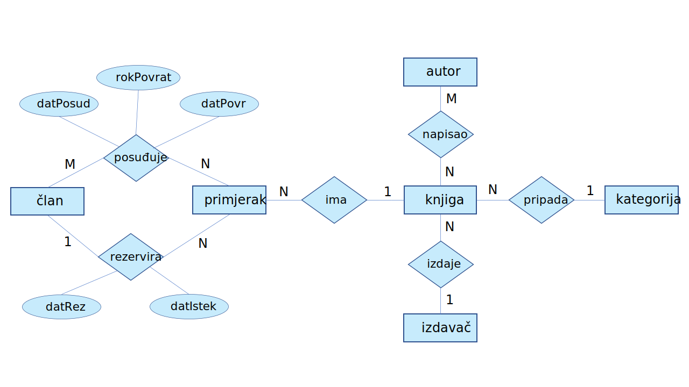

# Knjižnica

## Informacijski sustav knjižnice

Potrebno je modelirati informacijski sustav knjižnice koji omogućava sljedeće funkcionalnosti:

---

### 📚 Katalog knjiga

Za svaku knjigu evidentiraju se osnovni podaci:
- naslov  
- jedinstveni ISBN  
- kategorija  
- izdavač  

Dodatno:
- Knjiga može imati **jednog ili više autora**  
- Autor može napisati **više knjiga**  
- Jedna knjiga može imati **više fizičkih primjeraka**

Za svaki primjerak bilježi se:
- jedinstveni inventarni broj  
- godina izdanja  
- broj izdanja  
- lokacija u knjižnici  
- trenutačni status:
  - slobodan  
  - posuđen  
  - rezerviran  

---

### 👤 Evidencija članova

Za svakog člana evidentiraju se:
- članski broj  
- ime i prezime  
- OIB  
- adresa  
- email  
- datum učlanjenja  
- status:
  - aktivan  
  - deaktiviran  

> Neaktivan član ne može posuđivati ni rezervirati knjige.

---

### 🔄 Posudba knjiga

- Član može posuditi **samo slobodan primjerak**
- Za svaku posudbu evidentiraju se:
  - datum posudbe  
  - rok vraćanja  
  - datum stvarnog vraćanja  

Sustav:
- vodi povijest svih posudbi  
- omogućuje pregled:
  - po članu  
  - po primjerku  

> Jedan primjerak može biti posuđen samo jednom u danom trenutku.

---

### 📌 Rezervacija slobodnih primjeraka

- Ako je primjerak slobodan, član ga može rezervirati na **ograničeno vrijeme** (npr. 2 dana)
- Tijekom rezervacije primjerak **nije dostupan drugim članovima**

Rezervacija se uklanja:
- nakon isteka roka  
- ili nakon realizirane posudbe  

> Jedan primjerak može imati najviše jednu aktivnu rezervaciju.

## ER dijagram

## Relacijski model

## DDL

Kompletan DDL:
[ddl/knjiznica.sql](ddl/knjiznica.sql)